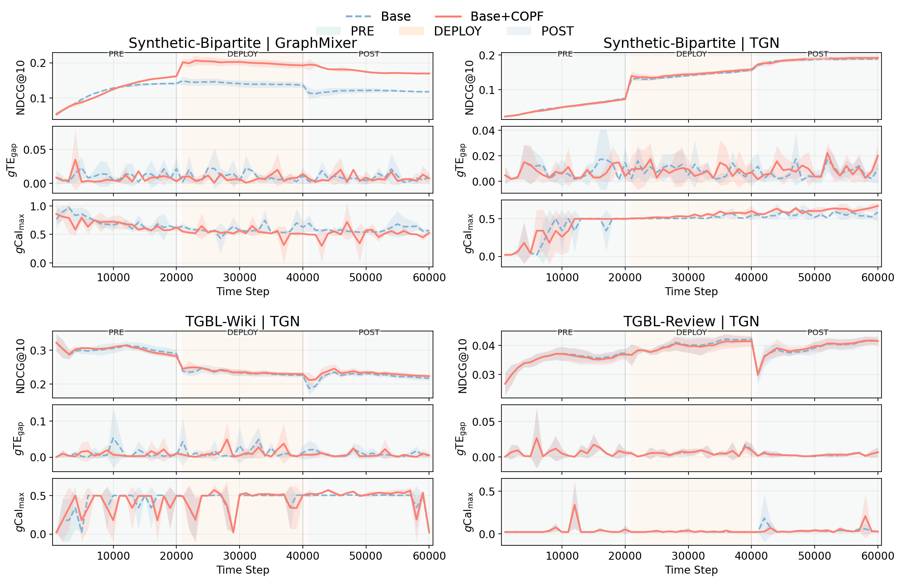

# COPF: Counterfactual Online Performative Fairness

This repository contains the implementation for **COPF**, a decision-layer framework for monitoring and controlling deployment-stable counterfactual fairness in online link recommendation on evolving graphs.

**Paper link coming soon.**

<p align="center">
  
</p>


## Data

### TGB streams

We evaluate on Temporal Graph Benchmark streams such as `tgbl-wiki` and `tgbl-review`. TGB data files are not redistributed in this repository. Download them with the official TGB package or provide an explicit CSV edgelist path to the runner.

Example:

```bash
python - <<'PY'
from tgb.linkproppred.dataset import LinkPropPredDataset
for name in ["tgbl-wiki", "tgbl-review"]:
    ds = LinkPropPredDataset(name=name, root="data/tgb/datasets", preprocess=True)
    print(name, "downloaded under:", ds.root)
PY
```

TGB streams do not include demographic attributes. The runner therefore supports synthetic or structural group constructions through flags such as `--tgb_group_mode node_mod` and `--group_on dst`.

### Synthetic bipartite stream

Synthetic streams can be generated locally:

```bash
python scripts/make_synth_bipartite.py \
  --out_dir data/synth/bipartite_v1/seed42 \
  --seed 2026 \
  --n_users 600 \
  --n_items 4000 \
  --n_events 200000
```

For this generator, user nodes carry the group label, so synthetic runs should use `--group_on src`.

## Quick start

A small synthetic run with COPF enabled:

```bash
python -u scripts/run_copf.py \
  --dataset synth \
  --data_dir data/synth/bipartite_v1/seed42 \
  --model graphmixer \
  --group_on src \
  --pre_T 20000 --deploy_T 20000 --post_T 20000 --T 60000 \
  --policy topk_stochastic --topk 10 \
  --epsilon 0.20 --temperature 1.0 \
  --deploy_epsilon 0.02 --deploy_temperature 0.7 \
  --post_epsilon 0.02 --post_temperature 0.7 \
  --neg 200 --hits_k 10 \
  --outcome_mode bandit \
  --log_every 1000 --oi_window 50000 \
  --audit_every 1000 \
  --pre_apply_calibrator \
  --covexp_enable \
  --pd_enable --pd_apply_phases deploy,post \
  --seed 2026 \
  --out_dir out/synth_graphmixer_copf_seed2026
```

A pure backbone baseline under the same OPP logging protocol can be run by disabling COPF interventions:

```bash
python -u scripts/run_copf.py \
  --dataset synth \
  --data_dir data/synth/bipartite_v1/seed42 \
  --model graphmixer \
  --group_on src \
  --pre_T 20000 --deploy_T 20000 --post_T 20000 --T 60000 \
  --policy topk_stochastic --topk 10 \
  --epsilon 0.20 --temperature 1.0 \
  --deploy_epsilon 0.02 --deploy_temperature 0.7 \
  --post_epsilon 0.02 --post_temperature 0.7 \
  --neg 200 --hits_k 10 \
  --outcome_mode bandit \
  --log_every 1000 --oi_window 50000 \
  --audit_every 0 \
  --seed 2026 \
  --out_dir out/synth_graphmixer_base_seed2026
```


## Citation

```bibtex
@inproceedings{li2026copf,
  title     = {COPF: An Online Framework for Deployment-Stable Counterfactual Fairness in Evolving Graphs},
  author    = {Li, Sheng'en and Zou, Dongmian},
  booktitle = {Proceedings of the 43rd International Conference on Machine Learning},
  year      = {2026},
  note      = {https://openreview.net/forum?id=2Nfr4u3pK2}
}
```
